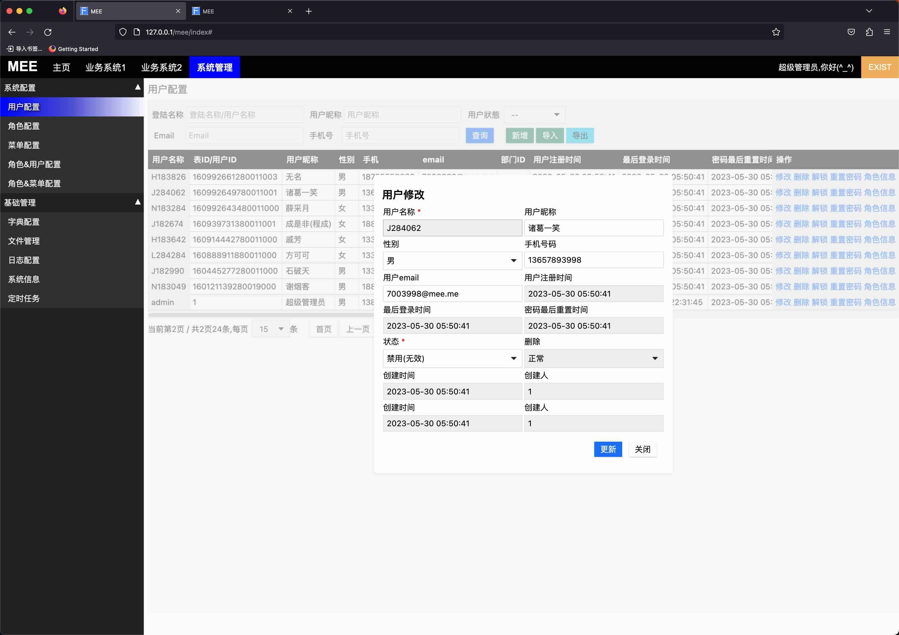
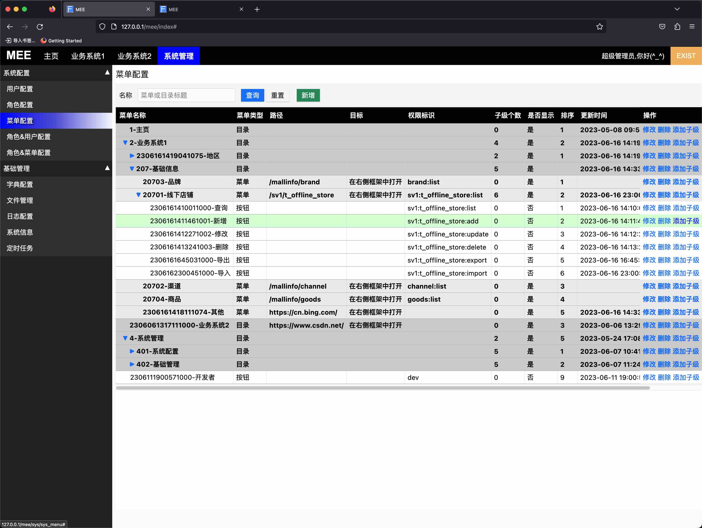
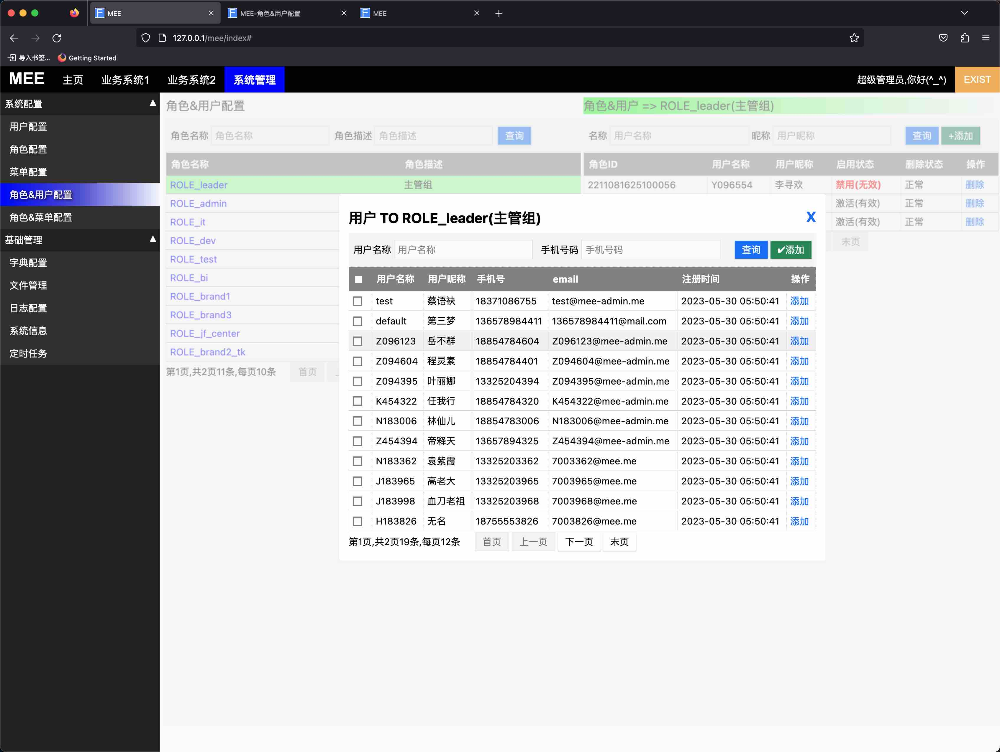
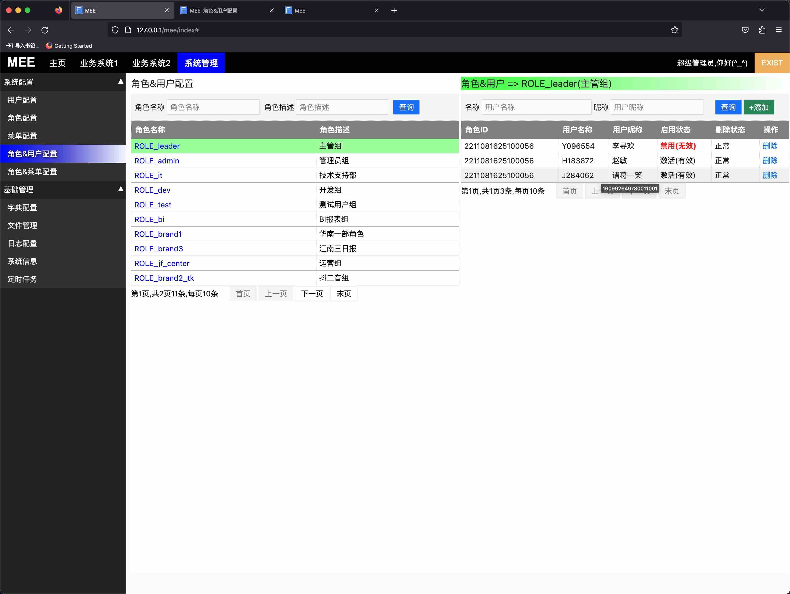
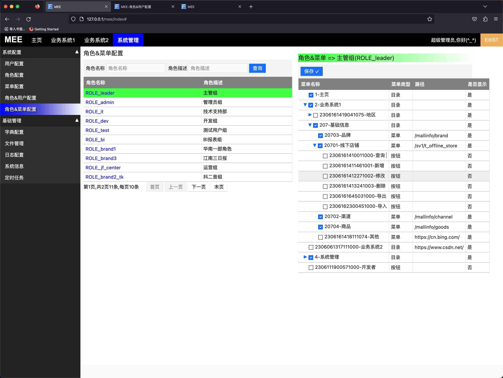
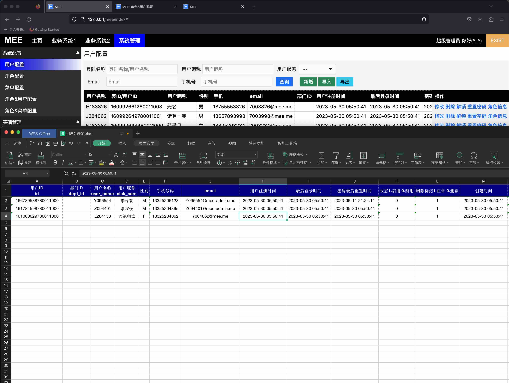
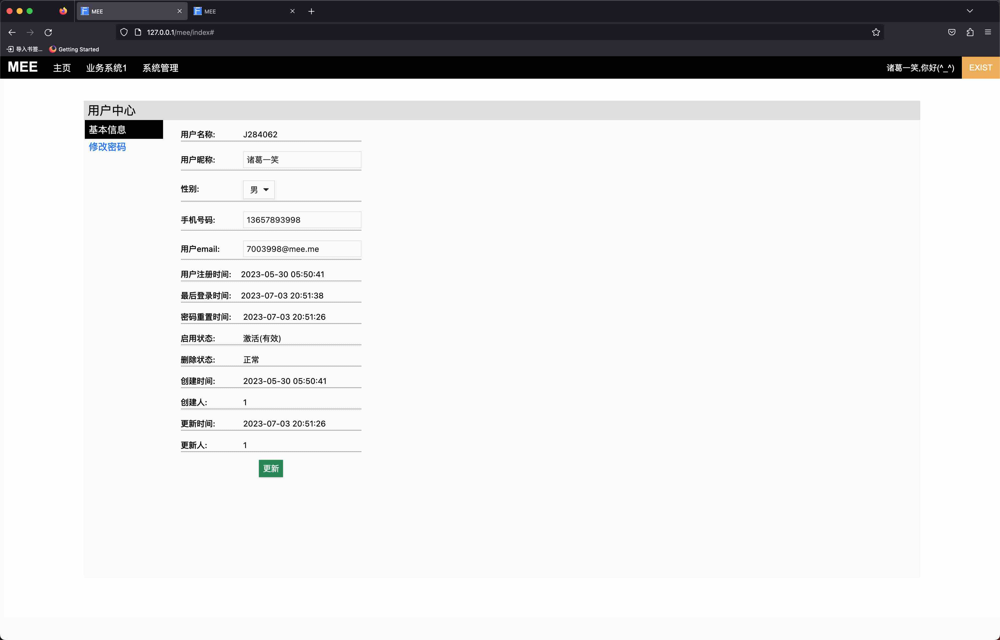
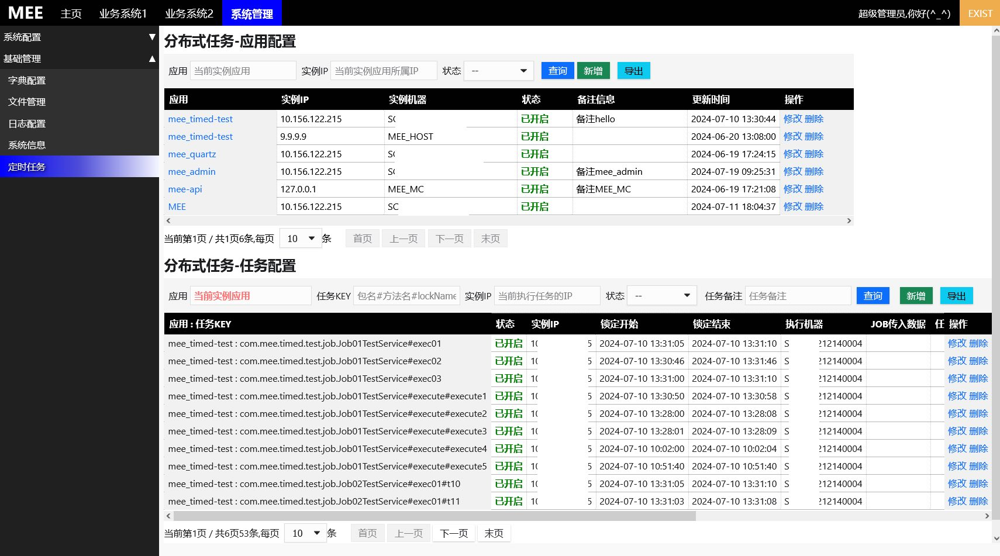
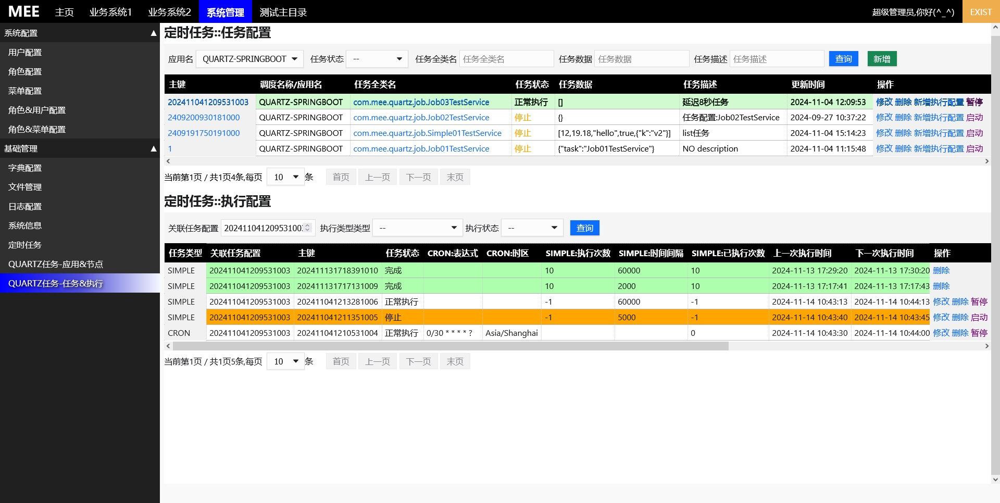

## 开源后台管理系统(MEE-ADMIN)
 这是一套由本人写到的后台系统，从0开始，其中v1.5是从2022年12月份开始一直开发现在(2023年7月3日)，这个项目耗费了我太多心血❤,如果您看到了觉得还行请[点赞](https://github.com/funnyzpc/mee-admin)
如果能[FORK🎈](https://github.com/funnyzpc/mee-admin/fork)那可太感谢了~😉

### v1.1.0  **🎉**
+ 添加Quartz后管
+ 修复了菜单按钮展示在菜单的问题
+ 添加js事件
+ 表单展示优化
+ excel操作类优化
+ 


### v1.0.2
+ js对象合并问题
+ fetch请求在session失效时重定向问题
+ 文件下载bug
+ 进一步简化module参数项
+ controller到service层抽出接口
+ 新增定时任务及集群配置(new)
+ 


### v1.0.1+相较于v1.0.0
+ 🍊几乎重构了所有前端页面
+ 🍎前端合理化布局及添加了复杂交互
+ 💃后端接口拆分及细致化权限管理
+ 🧍‍移除了jQuery以及所有与jQuery相关的扩展插件
+ 🎈添加了个人中心
+ 🍌优化了字典配置及前端字段配置相关
+ 😼简化了表单验证
+ 😁添加了代码生成，简化开发难度（后续会提供）
+ 🔪修复了分页bug
+ 🌷等等...

### 代码生成
  本项目配合`mee-generator`可大幅提高开发效率，从前端到后端可全部使用`mee-generator`生成，你可能需要做的只是点点鼠标而已~
+ 👏[mee-generator](https://github.com/funnyzpc/mee-generator)来啦～^o^～

### UI预览
>
>
>
>
>
>
>
>
>
>

#### 主要技术栈
+ SpringBoot 2.6
+ MyBatis
+ Freemarker
+ Postgresql
+ Shiro
+ ShedLock
+ 等等...

### 快速开始（quick start）
+ 准备IDE(推荐IDEA community)、jdk17、mysql或postgresql
+ 导入sql文件：
  - [mysql_init.sql](doc%2Fmysql_init.sql)为mysql数据表，schema为mee_admin
  - [pg_init.sql](doc%2Fpg_init.sql)为postgresql数据表,schema为mee_admin,先建库再建schema(不要使用public schema)
+ Fork 项目[MEE-ADMIN](https://github.com/funnyzpc/mee-admin/fork) 到自己的账号下
+ clone项目到本地
+ IDE文件调整为UTF-8 : setting->File encoding(文件编码)
+ 启动 [MeeAdminApplication.java](src%2Fmain%2Fjava%2Fcom%2Fmee%2FMeeAdminApplication.java)
  - IDE指定配置环境 `--spring.profiles.active=dev`
  - 添加加密参数(非必须) `-Djasypt.encryptor.password="0989Gn8hcc}{||>.<||}0101"`
+
### 打包（packaging）
+ development environment
    - `mvn clean -Dmaven.test.skip=true package -Pdev`
    
+ test environment
    - `mvn clean -Dmaven.test.skip=true package -Ptest`

+ product environment
    - `mvn clean -Dmaven.test.skip=true package -Pprod`

### 部署脚本（deploy script）
+ 本地命令行启动jar
  ```
  java -jar mee-admin.jar --server.port=8001 
  ```

+ 测试部署test deploy
  ```echo 正在启动mee-admin.....
  ps -ef|grep mee.jar|grep java|awk '{print $2}'|xargs kill -9
  cd /mnt/app/8001-mee-admin && nohup /usr/local/java/jdk1.8.0_261/bin/java -jar /mnt/app/8001-mee/mee-admin.jar --server.port=8001 --spring.profiles.active=test  1>/mnt/app/8001-mee-admin/logs/mee-admin_ALL.log 2>/mnt/app/8001-mee-admin/logs/mee_ALL.log &
  ```

+ 生产部署prod deploy
  ```echo 正在启动mee-admin.....
  ps -ef|grep mee-admin.jar|grep java|awk '{print $2}'|xargs kill -9
  cd /mnt/app/8001-mee-admin && nohup /usr/local/java/jdk1.8.0_261/bin/java -jar /mnt/app/8001-mee-admin/mee-admin.jar --server.port=8001 --spring.profiles.active=prod  1>/mnt/app/8001-mee-admin/logs/mee-admin_ALL.log 2>/mnt/app/8001-mee-admin/logs/mee-admin_ALL.log &
  ```
