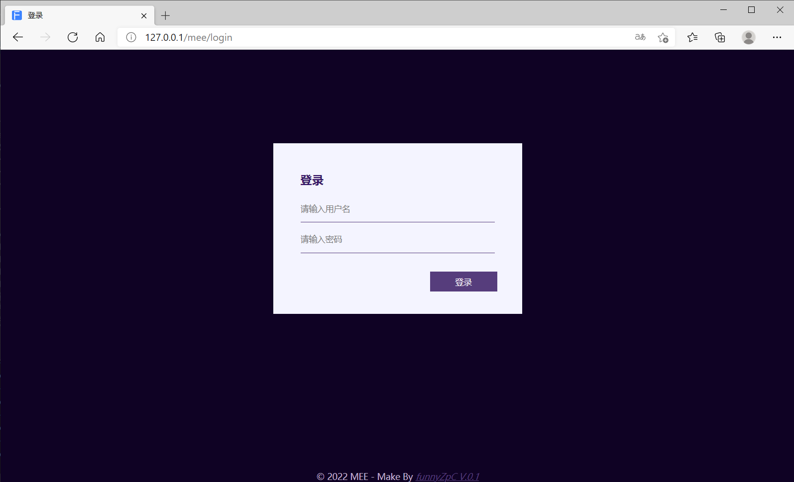
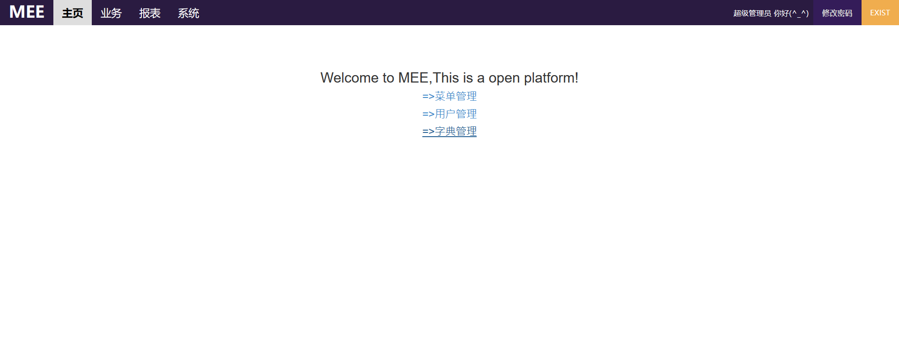
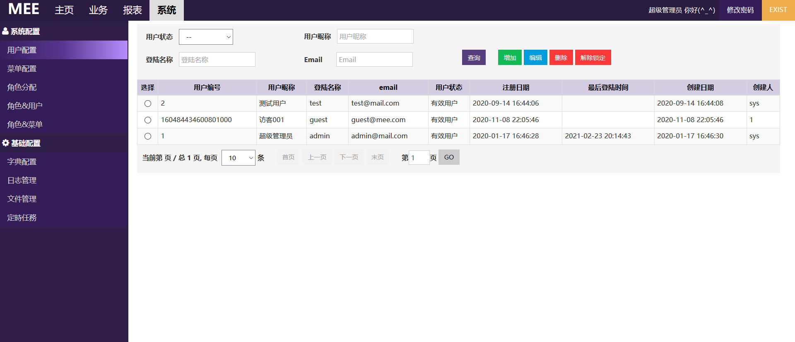
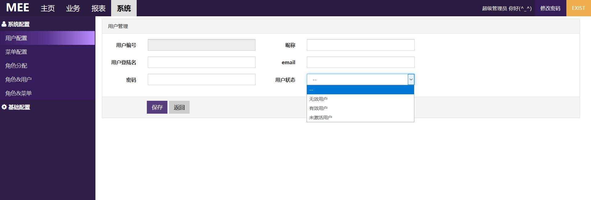
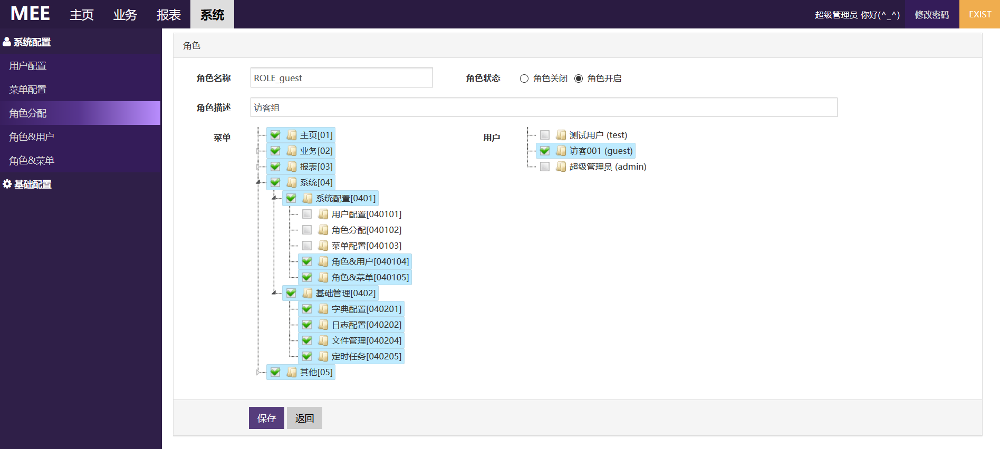

### 开源后台管理系统(MEE)

#### overview
+ 
+ 
+ 
+ 
+ 

#### 主要技术栈
+ SpringBoot 2.4.3
+ MyBatis
+ Freemarker
+ Postgresql
+ Shiro
+ ShedLock
+ netty(用于延迟任务)

#### quick start
+ Fork [MEE](https://github.com//funnyzpc/mee/fork) to your repository
+ git clone  `your fork project address `
+ add this to your idea _Program arguments_ `--spring.profiles.active=dev`
+ add this to your idea _VM options_ `-Djasypt.encryptor.password="0989GoEncc}{||>.<||}0101"`
+ startup MEE in `MeeApplication`
+ change password,see `MD5Util`

#### packaging
+ development environment
    - `mvn clean -Dmaven.test.skip=true package -Pdev`
    
+ test environment
    - `mvn clean -Dmaven.test.skip=true package -Ptest`

+ product environment
    - `mvn clean -Dmaven.test.skip=true package -Pprod`

#### deploy script
>>> local(windows) deploy
+ ` java -jar mee.jar --server.port=8001 `

>>> test deploy
+ `echo 正在启动mee模块.....`
+ `ps -ef|grep mee.jar|grep java|awk '{print $2}'|xargs kill -9`
+ `cd /mnt/app/8001-mee && nohup /usr/local/java/jdk1.8.0_261/bin/java -jar /mnt/app/8001-mee/mee.jar --server.port=8001 --spring.profiles.active=test  1>/mnt/app/8001-mee/logs/mee_ALL.log 2>/mnt/app/8001-mee/logs/mee_ALL.log &`

>>> prod deploy[TODO need edit](#)
+ `echo 正在启动mee模块.....`
+ `ps -ef|grep mee.jar|grep java|awk '{print $2}'|xargs kill -9`
+ `cd /mnt/app/8001-mee && nohup /usr/local/java/jdk1.8.0_261/bin/java -jar /mnt/app/8001-mee/mee.jar --server.port=8001 --spring.profiles.active=test  1>/mnt/app/8001-mee/logs/mee_ALL.log 2>/mnt/app/8001-mee/logs/mee_ALL.log &`

#### 功能模块
+ 系统及全局配置
    - 日志管理(开发中)
    - 字典配置(完成)
    - 系统监控(开发中)
    - 完善shiro功能(完成)
    - 优化页面嵌套(完成)
    - 优化表结构(完成)
    — 添加DAO逻辑(完成)

+ 用户及菜单管理
    - 菜单管理
    - 用户管理[new](#)
    - 角色管理[new](#)
    - 用户角色管理(开发中)
    - 角色菜单管理(开发中)

#### 需要说明
+ 本系统不兼容任何IE浏览器,请使用chrome 、firefox、safari

+ 整体介绍
  - [基本介绍](https://www.cnblogs.com/funnyzpc/p/13777881.html)
  
+ 对于前端
    - 使用handlebar作为模板
    - 使用seajs作为模块管理工具
    - 基本增删改查参考tablex

+ 对于后端
    - 使用springboot作为基础框架
    — 使用jdk8作为应用运行环境
    - 使用mybatis作为DAO层(仅仅使用)

+ 功能开发流程
    - 添加mybatis SQL xml文件及映射实体类entity
    - 编写控制器controller及业务service代码
    - 编写构建前端页面并添加菜单项
    - 添加依赖js[resources/public/module 下](#)
    - 后端添加权限标识[@RequiresPermissions("权限编码(需要与菜单配合)")](#)
    - 前端(菜单和业务页面)添加权限标识[<@shiro.hasPermission name="权限编码"></@shiro.hasPermission>](#)
    - 后台添加菜单项目
    - 角色权限分配

+ js添加对话框或按钮扩展功能([难点!](#))
    ``` 
       业务前端js采用模块化依赖并封装了表单著录以及增删改查相应功能，十分便捷，
    目前对于扩展功能(比如添加一个’重算‘) 需要自定义函数及相应逻辑，具体流程大致如下
    ```

  1. 在[search-form](#)内定义button控件(一定要有name属性)
  2. 在依赖的js文件内的init函数内定义扩展`toolbar:{ "控件属性名": 属性名对应函数 }`
  3. 编写相应业务逻辑
  
#### change info
+ 字典可用性问题(含缓存及加载问题解决)
+ 登录日志功能
+ 项目文档补充 
+ 添加最后登录时间记录 
+ shiro版本更新(解决安全性问题)
+ springboot版本升级至2.4.3
+ 登录用户不存在问题(优化提示)
+ 添加账户锁定防止恶意用户猜密码
+ 登录用户cookie客户端服务器有效性问题
+ 用户搜索bug
+ 菜单切换整体刷新问题
+ UI整体改造
+ 用户角色关系bug修复
+ 添加延迟任务功能(DelayTask)

#### issues or improve
+ 输入框自动带出优化
+ bootstrap弹出框设计及构建
+ websocket消息推送功能
+ 功能开发文档编写
+ Controller params support LocalDateTime
+ 分页缓存
